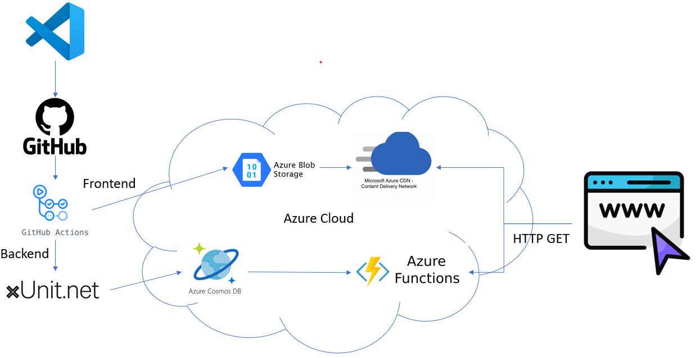

# azure-resume
This is my Cloud Resume Challenge built on Azure which my progect to get hands-on and understand Azure Cloud.
Here is my AzureCloudResume Website : [here](https://www.chongchin.org)

If you wish to build your own Azure Cloud Resume, you may refer to YouTube [video](https://youtu.be/ieYrBWmkfno) by Gwyneth. :)



## Resources:

If you followed [video](https://youtu.be/ieYrBWmkfno), you will face some steps is no longer valid which .net version 3 is no longer support and also some UI in Azure cloud is not same anymore.

This is exciting to troubleshoot and get understanding in depth. :)

Here is my resources using with up to date.
- [.Net 8.0](https://dotnet.microsoft.com/en-us/download/dotnet/8.0)
- CosmoDB version
```
dotnet add package Microsoft.Azure.Functions.Worker.Extensions.CosmosDB --version 4.11.0
```
- Azure function : you need to create unique function

